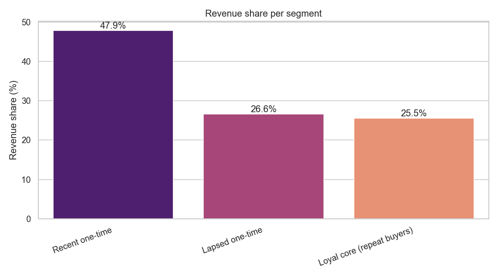
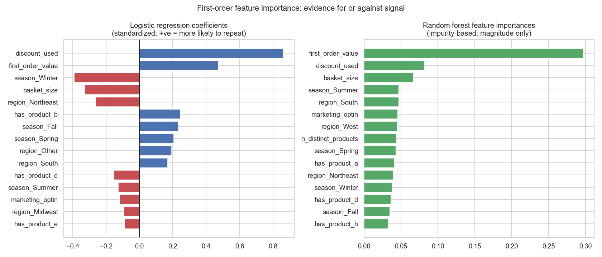
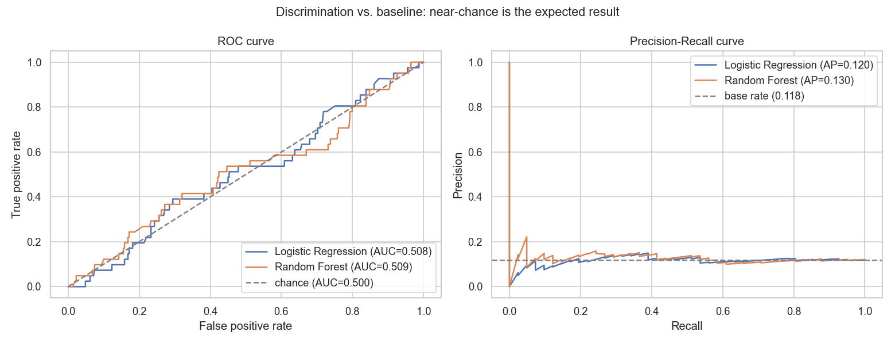

# Customer Retention Analytics for a DTC E-Commerce Brand

End-to-end analytics on a DTC e-commerce brand's Shopify data, from BI report to a retention model.

## The finding

This project analyzes real Shopify order data from a direct-to-consumer e-commerce brand (referred to here as the client), and was built as both a client deliverable for the company's CEO and a portfolio piece. Product names and other identifying details have been anonymized.

The core problem is retention. Across 1,505 customers and 1,621 orders, only about 12 percent of customers ever place a second order (181 repeat customers), yet returning customers are worth roughly twice as much as one-time buyers. The business depends on a small group of repeaters that has been hard to grow.

The more useful result is why that gap exists. A repeat-purchase classifier trained only on first-order attributes (what was bought, order value, discount use, basket size, marketing opt-in, location, and season) lands at a ROC-AUC near 0.51, which is essentially chance. Nothing observable about a customer's first purchase predicts whether they come back. The retention gap is structural rather than a matter of attracting better first-time buyers.

That shifts the strategy away from trying to pre-select high-retention customers, which the data says is not possible, and toward broad lifecycle messaging aimed at everyone. Two plays follow directly from the segmentation:

- A 31 to 90 day post-purchase email sequence aimed at recent one-time buyers, to earn the critical second order before they lapse.
- A win-back campaign aimed at customers who bought once and then went quiet, with a reactivation offer.

## What is in the repo

- `sql/` holds the SQL transformations that clean the raw Shopify exports and reshape them into the modeled tables behind the report.
- `powerbi/` holds the Power BI report: a star schema with dimension tables and geographic analysis, presented to the CEO.
- `deck/` is the executive presentation of the findings and recommendations.
- `ml/` is the data-science layer: Phase 1 covers customer segmentation and Phase 2 covers the repeat-purchase classifier. Generated charts and tables land in `ml/outputs/`, where the tracked files are aggregate charts, written summaries, and anonymized (hashed-email) extracts. The raw customer files stay out of the repo.

## Methodology notes

A few choices are worth calling out, since how the analysis was done matters as much as the result.

- k = 3 over the silhouette-optimal k = 2. The cleanest clustering metric preferred two groups, one-time versus repeat, but the one-time block is a continuous spread rather than a natural cluster. Shipping three segments splits the one-time buyers into recent and lapsed, which maps directly onto the two email campaigns. The lower silhouette score at k = 3 is reported openly rather than hidden.
- Excluding the zero-dollar comp cohort. Around 100 records are influencer, affiliate, and sample-seeding orders at zero revenue, not paying customers. They are profiled separately and excluded from the segmentation and the model so the headline numbers describe real purchasing behavior.
- A strict leakage firewall in Phase 2. Every feature comes from the customer's first order only. The label, whether a second order ever happened, is derived from order counts in the raw export. `Returning_customers.csv`, which contains outcome columns such as lifetime order count and total spend, is never read, so future information cannot leak into the model.
- Subtotal in Phase 2, Total in Phase 1. Phase 1 measured economic value, so it used order Total including shipping and tax. Phase 2 predicts behavior and wants basket value independent of where the order shipped, so it uses Subtotal. The difference is deliberate, not an inconsistency.
- Reporting a null result honestly. A near-chance model is the correct and expected outcome here, and the flat feature importances are the evidence that the retention gap is structural. No leaky features were engineered to manufacture a more impressive number.

## Key visuals

Revenue share by segment. The loyal core is about 12 percent of paying customers but a quarter of revenue, while recent one-time buyers are the largest near-term opportunity.



First-order feature importance. Even the strongest first-order signals carry little weight, and the ones that look notable in-sample do not hold up out of sample.



Model discrimination against the baseline. The ROC curve sits on the diagonal and the precision-recall curve sits on the base rate, which is the signature of a model that cannot separate repeaters from non-repeaters.



## Reproducing the analysis

The pipeline runs on a synthetic sample dataset that ships with the repo, so you can reproduce the full workflow without the private customer data. The sample mirrors the structure and quirks of the real export, including its line-item layout.

```
git clone <repo-url>
cd customer-retention-analytics
python3 -m venv .venv
source .venv/bin/activate
pip install -r requirements.txt

python ml/segmentation/segment_customers.py --input data/sample/orders_sample.csv
python ml/classifier/repeat_classifier.py --input data/sample/orders_sample.csv
```

Both scripts write their charts and tables to `ml/outputs/`. Omit `--input` to run against `data/orders.csv`, the real export, which is not included in the repo. Because the sample is small, its numbers differ from the findings above, which come from the full dataset.

The pipeline reads product family mappings from `config/product_mappings.json`. A `config/product_mappings.example.json` is provided and matches the synthetic sample, so the code is runnable end-to-end on the included sample dataset without any extra setup. The charts and metrics committed in `ml/outputs/` reflect the analysis on the real (private) client dataset, produced locally with a non-committed config that maps the real line-item strings to the same Product A through E families.

## Tech stack

Python (pandas, numpy, scikit-learn, matplotlib, seaborn) for the data-science layer, Power BI for the report, and SQL for the upstream transformations.
